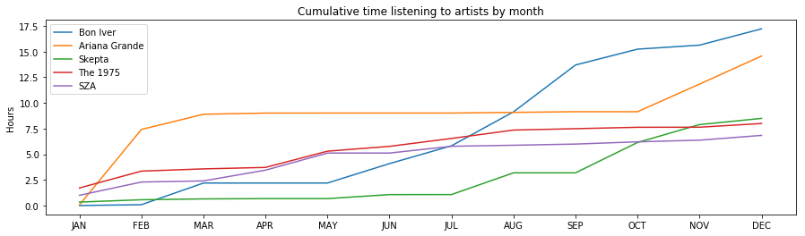

# SQL---Spotify-Wrapped-Myself
 Using SQL to explore Spotify streaming history database
 
  
 
 The main notebook here is spotify_wrapped_myself.ipynb. You should read that.
 
 In the create_artist_table.ipynb I use the Spotify Web API to populate a second table in the database with information on the different  artists I listened to throughout the year. This artist table is used in the main notebook. 
 
 I have put the actual sql database in the .gitignore just to protect my data a bit.
 
